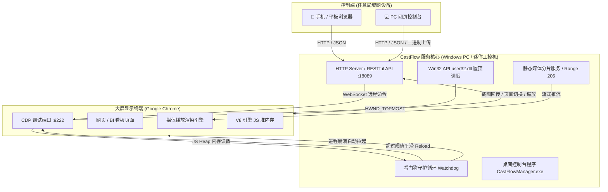

<div align="center">

# 📺 CastFlow

**专为企业大屏、展厅看板、数字标牌打造的超轻量局域网投屏与无人值守控制系统**

*Lightweight Big-Screen Kiosk & Digital Signage Controller powered by Chrome DevTools Protocol (CDP)*

<p align="center">
  <a href="https://github.com/caoyek/castflow/actions/workflows/build.yml"></a>
  <a href="https://github.com/caoyek/castflow/stargazers"></a>
  <a href="https://github.com/caoyek/castflow/blob/main/LICENSE"></a>
  <a href="https://nodejs.org/"></a>
  <a href="https://www.google.com/chrome/"></a>
  <a href="https://github.com/caoyek/castflow"></a>
  <a href="https://github.com/caoyek/castflow/pulls"></a>
</p>

[功能特性](#-核心特性) • [为什么选择 CastFlow](#-为什么选择-castflow) • [系统架构](#-系统架构) • [快速开始](#-快速开始) • [配置说明](#-配置说明) • [RESTful API](#-开放-api-接口)

</div>

---

## 💡 为什么选择 CastFlow？

在商场展厅、企业前台、生产车间与会议室的日常大屏运维中，传统方案常常面临以下痛点：

| 常见痛点 | 传统方案表现 | 🚀 CastFlow 解决方案 |
| :--- | :--- | :--- |
| **长期挂机白屏/崩溃** | BI 看板/前端动画长期运行导致内存泄露，几天后页面直接崩溃或黑屏 | **JS Heap 内存看门狗**：毫秒级采集堆内存，超过阈值平滑无感重载页面 |
| **浏览器意外关闭** | Windows 升级、显卡重置或误触关闭大屏浏览器，屏幕陷入桌面 | **自动复活守护机制**：秒级探测 Chrome 存活，异常退出 30 秒自动拉回掉线前页面 |
| **烦人的恢复气泡** | 非正常杀掉 Chrome 后，下次启动必弹「Google Chrome 异常关闭，是否恢复？」弹窗 | **CDP 优雅退出通道**：优先走 CDP `Browser.close` 写入安全退出标志，启动带防恢复参数 |
| **系统弹窗遮挡大屏** | 后台杀毒软件、系统更新通知弹窗抢占焦点，盖住投屏内容 | **Win32 硬件级置顶**：调用 `user32.dll` 的 `SetWindowPos` 强制将大屏窗口置于最顶层 |
| **远程盲投无反馈** | 坐在工位上远程推屏，根本不知道大屏实际显示成什么样 | **实时推流监视预览**：基于 CDP Page 截图通道，在手机/电脑控制台实时监看大屏渲染画面 |
| **体积臃肿与依赖环境** | 传统方案动辄依赖 300MB+ 的 Puppeteer/Playwright 或重量级 Electron | **超轻量原生自研**：生产环境仅需 1 个 npm 包（`ws`），单 EXE 绿色打包内置运行时，体积减小 90% |

---

## ✨ 核心特性

- 📱 **极客暗黑 Web 控制台**：单页 SPA 响应式设计，局域网内任意手机、平板、笔记本直接通过浏览器远程控制，无需安装任何客户端 App。
- 🖥️ **实时画面回传预览**：控制台内置大屏实时流监看，支持随时手动截图、页面重载、缩放比例切换（50% ~ 500%）与全屏控制。
- 📑 **智能多标签页管理**：大屏打开的所有标签页在控制台一目了然，支持任意标签页静默切换、平滑新建与一键关闭。
- 🎬 **全能媒体库投放**：
  - **网页与 BI 大屏**：支持任意 HTTP/HTTPS 链接推送，内置收藏夹支持多看板快捷切换；
  - **自适应图片展示**：支持拖拽上传 JPG/PNG/GIF/WebP，自适应暗黑背景平铺呈现；
  - **超大高清视频流**：内置支持 HTTP 206 Partial Content 分片传输，百兆/千兆大码率视频任意拖拽进度条不卡顿。
- 🛡️ **高可用工业级看门狗 (Watchdog)**：
  - **内存看门狗**：按设定时间循环巡检 V8 JS 堆内存，超过阀值（如 400MB）平滑自动重载，避免页面崩死；
  - **异常退出自动拉起**：若大屏浏览器崩溃或被误关，守护进程 30 秒内按崩溃前展示的原网址自动重启拉起并恢复全屏；
  - **定时自动刷新**：针对固定展示的动态 BI 看板，支持自定义每隔 N 分钟自动刷新一次数据；
  - **定时维护重启**：支持每天/每周指定闲时时刻（如凌晨 04:00）全自动重启浏览器，彻底释放句柄与显存。
- 🔒 **硬件级窗口置顶**：原生集成 Win32 API `SetWindowPos(HWND_TOPMOST)`，即便有杀毒软件弹窗或系统通知，也无法遮挡大屏。
- 🛠️ **精巧的运维支持**：
  - 提供轻量级 Windows 原生桌面控制台（`CastFlowManager.exe`，暗黑科技质感 UI，托盘常驻守护，无命令行黑框弹窗）；
  - 提供一键 Inno Setup 完整安装包，安装时自动配置 Windows 防火墙规则、自动禁用系统睡眠熄屏策略、自动注册用户交互式计划任务。

---

## 🏗️ 系统架构



---

## 🚀 快速开始

### 方式一：下载绿色版 / 安装包（推荐）

1. 从 [Releases](https://github.com/caoyek/castflow/releases) 页面下载最新版安装程序 `CastFlow-Setup-x.x.x.exe`。
2. 双击安装（需要管理员权限以配置防火墙与系统防休眠策略）。
3. 安装完成后，程序会自动拉起全屏大屏，并在浏览器中打开控制台：
   - **本机访问**：`http://127.0.0.1:18089`
   - **局域网访问**：`http://<大屏主机IP>:18089`（控制台右上角会自动显示当前局域网地址）

### 方式二：从源码运行

要求：大屏机器已安装 **Google Chrome** 和 **Node.js (>= 18)**。

```bash
# 1. 克隆仓库
git clone https://github.com/caoyek/castflow.git
cd castflow

# 2. 安装依赖 (极度轻量，仅需几秒)
npm install

# 3. 运行控制服务
npm start

# 或以自启全屏模式运行（自动唤起全屏 Chrome 并连接 CDP）
npm run autostart
```

控制台默认监听 `18089` 端口，通过浏览器访问 `http://localhost:18089` 即可开始使用。

### 方式三：本机桌面控制台程序（GUI 运维面板）

双击运行根目录下的 `CastFlowManager.exe` 即可打开暗黑科技风格的桌面管理面板（亦可在任务栏托盘常驻持续守护）：

- 核心状态一目了然：服务运行状态、Chrome 标签页状态、本机访问地址
- 开机与启动默认页：直接在面板内配置默认展示网址，支持一键保存
- 一键管理操作：`[1] 启动服务` / `[2] 停止服务` / `[3] 重启服务`
- 系统级守护联动：开机自启开关、定时关机设置、查看系统日志

---

## 📦 打包与安装包构建

CastFlow 支持打包为脱离 Node.js 环境的单目录绿色发行包和 Inno Setup 标准安装包。

### 1. 构建二进制发行包

运行打包脚本（使用 `@yao-pkg/pkg` 打包 Node 22 运行时）：

```powershell
powershell -ExecutionPolicy Bypass -File build.ps1
```

打包完成后将在 `dist/CastFlow/` 目录下生成全部免安装运行时文件：
- `CastFlow.exe`（内置 Node 22 运行时的完整控制程序）
- `CastFlowManager.exe`（Windows 原生桌面管理控制台）
- `app.ico`（应用图标）
- `public/`（Web 控制台静态文件）
- `media/`（多媒体存放目录）
- `topmost.ps1`（窗口置顶脚本）

### 2. 编译 Inno Setup 安装包

已安装 [Inno Setup 6](https://jrsoftware.org/isdl.php) 后执行：

```powershell
iscc installer.iss
```

将在 `dist/` 目录下生成 `CastFlow-Setup-1.0.0.exe`，安装包已内置：
- 自动检测 Google Chrome 安装状态；
- Windows 防火墙自动放行控制端口规则；
- 自动配置 `powercfg` 彻底关闭显示器息屏与主机休眠；
- 注册用户登录计划任务（避免 Windows Session 0 隔离导致黑屏）。

### 3. GitHub Actions 云端一键在线编译（无需本地安装任何环境）

本项目已完整配置 GitHub Actions 自动化 CI/CD 工作流：

1. **手动一键触发**：在 GitHub 仓库页面点击 **Actions** -> 选择 **Build Windows Installer** -> 点击 **Run workflow**，GitHub 官方 Windows 虚拟机将自动执行 C# 编译、Node 打包、Inno Setup 安装包构建，并在几分钟内生成安装包供直接下载！
2. **下载构建产物**：构建完成后，在构建详情页底部的 **Artifacts** 处可直接下载：
   - `CastFlow-Windows-Installer`：标准一键安装包 `CastFlow-Setup-1.0.0.exe`
   - `CastFlow-Portable-Zip`：免安装绿色便携版压缩包 `CastFlow-Portable.zip`
3. **自动发布 Release**：当在仓库推送版本标签（例如 `git tag v1.0.0 && git push origin v1.0.0`）时，云端会自动生成 GitHub Release，并将安装包和绿色便携包挂载为公开下载附件。

---

## ⚙️ 配置说明

### `config.json`（核心启动配置）

```json
{
  "target": "127.0.0.1:9222",
  "port": 18089,
  "publicBase": "auto",
  "settleMs": 1500,
  "memoryLimitMb": 400,
  "memoryCheckSec": 60,
  "chromePath": "",
  "chromeProfile": "chrome-profile",
  "chromeExtraArgs": [
    "--start-fullscreen"
  ],
  "startUrl": "about:blank"
}
```

| 字段 | 类型 | 默认值 | 作用说明 |
| :--- | :--- | :--- | :--- |
| `target` | string | `127.0.0.1:9222` | Chrome CDP 调试通信地址与端口 |
| `port` | number | `8080` | 控制台 HTTP 监听端口 |
| `publicBase` | string | `auto` | 对外访问的基础 URL。填 `auto` 时会自动探测过滤掉 Docker/VPN 的最佳物理网卡 IPv4 |
| `settleMs` | number | `1500` | 页面切换后等待渲染稳定的延时（毫秒） |
| `memoryLimitMb` | number | `400` | JS 堆内存超限触发重载的阈值（MB） |
| `memoryCheckSec` | number | `60` | 看门狗内存巡检周期（秒） |
| `chromePath` | string | `""` | Chrome 安装路径（留空则从注册表及默认路径自适应发现） |
| `chromeProfile` | string | `chrome-profile` | 独立的用户数据目录，保证与大屏主机上日常使用的个人 Chrome 彻底隔离 |
| `startUrl` | string | `about:blank` | 开机自启时大屏默认打开的初始 URL |

### `settings.json`（大屏设备设置）

支持直接在 Web 控制台的「设置」界面热修改并实时生效：

```json
{
  "deviceName": "大屏展示终端",
  "autoRestart": true,
  "restartInterval": "day",
  "restartTime": "04:00",
  "memoryLimitMb": 400,
  "memoryWatchdog": true,
  "autoRestore": true,
  "autoRefresh": false,
  "refreshInterval": 30
}
```

---

## 🔌 开放 API 接口

CastFlow 提供轻量、纯粹的 HTTP RESTful API，方便第三方系统（如企业微信机器人、钉钉通知、工单系统、HomeAssistant）联动推屏：

### 1. 状态与监视
- `GET /api/status`：获取当前连接状态、激活标签、页面标题、URL、系统及 Chrome 内存占用情况；
- `GET /api/shot`：获取大屏当前画面的实时 JPEG 截图；
- `GET /api/tabs`：获取大屏当前所有打开的标签页列表。

### 2. 投屏控制
- `POST /api/push`：向大屏推送页面
  ```json
  // 请求体
  {
    "url": "https://your-bi-dashboard.internal",
    "mode": "navigate" // "navigate" 当前页加载，或 "tab" 标签页切换/新建
  }
  ```
- `POST /api/reload`：立即重载大屏当前页面；
- `POST /api/fullscreen`：切换全屏状态 `{"on": true}`;
- `POST /api/zoom`：调节页面缩放 `{"zoom": 1.25}`（支持 0.5 到 5.0）；
- `POST /api/tab`：切换激活标签页 `{"targetId": "..."}`;
- `POST /api/tab/close`：关闭指定标签页 `{"targetId": "..."}`。

### 3. 硬件与窗口控制
- `GET /api/chrome`：检查大屏 Chrome 进程运行状态；
- `POST /api/chrome/start`：唤起大屏 Chrome；
- `POST /api/chrome/stop`：通过 CDP 安全关闭大屏 Chrome；
- `POST /api/chrome/restart`：重启大屏 Chrome 并自动恢复当前显示的 URL；
- `POST /api/topmost`：开启/关闭大屏窗口最前置顶 `{"on": true}`。

### 4. 媒体库
- `GET /api/media`：获取已上传的音视频和图片文件列表；
- `POST /api/upload`：上传媒体文件（流式传输，Header 携带 `X-Filename`）；
- `POST /api/media/delete`：删除指定媒体文件 `{"name": "promo.mp4"}`。

---

## 🤝 贡献与反馈

欢迎提交 Issue 和 Pull Request！
如果您觉得 CastFlow 对您的项目或公司有所帮助，请给项目点一个 **⭐️ Star**，这是对我们最大的鼓励！

---

## 📄 开源许可证

本项目采用 [MIT License](LICENSE) 开源协议，允许任何个人或企业免费商用或二次开发。
